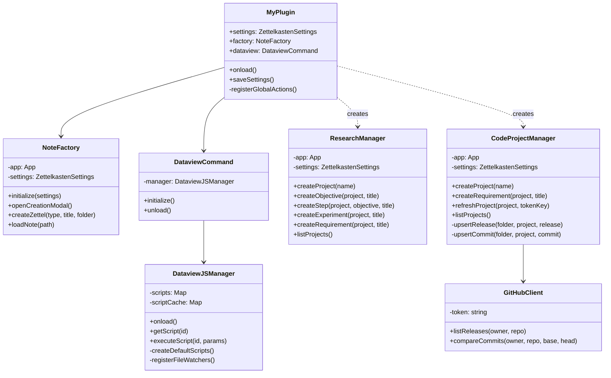
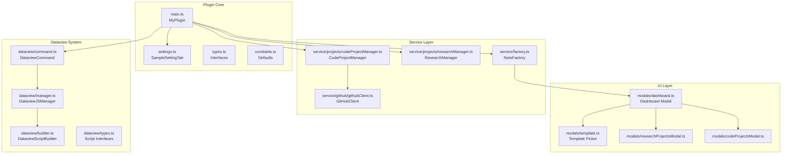
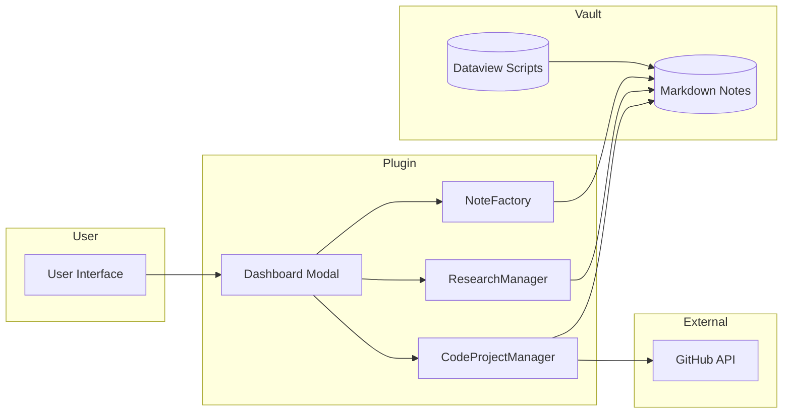

# Zettelkasten Operator

An Obsidian plugin for managing Zettelkasten notes with integrated project management for research papers and code projects.

## Table of Contents

- [Features](#features)
- [Installation](#installation)
- [Usage](#usage)
- [Architecture](#architecture)
- [Zettelkasten Notes](#zettelkasten-notes)
- [Research Project Management](#research-project-management)
- [Code Project Management](#code-project-management)
- [Dataview Integration](#dataview-integration)
- [Configuration](#configuration)
- [API Reference](#api-reference)

## Features

- **Zettelkasten Note Types**: Create and manage four core note types (Fleeting, Literature, Atom, Permanent)
- **Research Projects**: Manage academic research with objectives, steps, experiments, and requirements
- **Code Projects**: Track GitHub releases, commits, and link requirements to releases
- **Gantt Charts**: Visualize project timelines with PlantUML Gantt charts
- **Dataview Integration**: Custom Dataview scripts with file watching and hot-reload
- **Template System**: Configurable note templates with custom frontmatter properties

## Installation

1. Download the latest release from GitHub
2. Extract to your vault's `.obsidian/plugins/` folder
3. Enable the plugin in Obsidian Settings → Community Plugins

## Usage

Examples of common workflows:

- **Create a new note**: Click the **+** ribbon icon or run command *Create New Zettel Note* → choose note type (Fleeting / Literature / Atom / Permanent) → pick a template → enter title. The note is created in the folder set for that type (e.g. `004-Permanent/`).
- **Search and link**: Run *Open Zettelkasten Search* (or click Search in the dashboard). Set target folder, type to filter, then **Open** a result or **Insert** a `[[path|name]]` wikilink at the cursor. Double-click a result to add the current note to that note’s `sources` frontmatter.
- **Research project**: From the dashboard click **Research** → create or open a project. In the project’s `Dashboard.md`, use the Quick Actions block (objectives, steps, experiments, drafts). Create a draft, then use *Compile current draft to materials* and *Generate AI Prompt from current draft* with a draft file active.
- **Code project**: From the dashboard click **Projects** → create or open a project. In `Dashboard.md` set `repo` (e.g. `owner/repo`), choose PAT if private, then **Refresh** to sync releases and unreleased commits. Create requirements and link them to releases in the Requirements table.
- **Call plugin from a script**: In a Dataview JS block you can use `window.ZettelkastenOperator`, e.g. `await ZettelkastenOperator.createResearchDraft(dv.current().file.path, "My Draft")`. See [API Reference](#api-reference) and [docs/architecture.md](docs/architecture.md).

## Architecture

High-level: the plugin has a **core** (main, settings, types), a **service layer** (note factory, research/code managers, draft compiler, prompt generator, GitHub client), a **Dataview layer** (code-block processor + script manager), and a **UI layer** (dashboard, search, template/filename/project modals). Entry points are the ribbon, commands, and `window.ZettelkastenOperator`; Dataview blocks in notes call that API to create items. **For detailed architecture, component descriptions, call flows, and a debugging guide for new maintainers, see [docs/architecture.md](docs/architecture.md).** **For all PlantUML diagrams (class diagram and sequence diagrams), see [docs/diagrams.md](docs/diagrams.md).**

### Class Hierarchy (quick reference)



### Module Structure (quick reference)



### Data Flow



## Zettelkasten Notes

The plugin supports four core Zettelkasten note types:

| Type | Purpose | Default Path |
|------|---------|--------------|
| **Fleeting** | Quick capture of ideas | `001-Fleeting/` |
| **Literature** | Notes from sources | `002-Literature/` |
| **Atom** | Single concept notes | `003-Atom/` |
| **Permanent** | Refined, permanent notes | `004-Permanent/` |

### Note Type Hierarchy

All project-related notes use `type: permanent` as the base type with subtypes stored in tags:

```yaml
---
type: permanent
tags:
  - type/research-objective
title: My Objective
status: active
---
```

### Creating Notes

1. Click the **+** ribbon icon or use command palette
2. Select note type category
3. Choose or create a template
4. Enter note title

## Research Project Management

Research projects help manage academic papers with a structured hierarchy.

### Project Structure

```plain-text
Research/
└── MyProject/
    ├── Dashboard.md          # Project overview with Gantt chart
    ├── objectives/           # High-level goals
    │   └── Objective1.md
    ├── steps/                # Tasks linked to objectives
    │   └── Step1.md
    ├── experiments/          # Research experiments
    │   └── Experiment1.md
    ├── requirements/         # Project requirements
    │   └── Requirement1.md
    └── materials/            # Supporting materials
```

### Dashboard Features

The research dashboard includes:

- **Quick Actions**: Create objectives, steps, experiments, requirements
- **Gantt Chart**: PlantUML timeline visualization
- **Data Pipeline**: Track AI-processed papers
- **Tables**: List all objectives, steps, experiments

### Example: Research Dashboard

```markdown
---
type: permanent
tags:
  - type/research-project
project_id: ml_paper
project_name: ML Paper
status: active
start: 2024-01-01
end: 2024-06-30
---

# Research Command Center

## Quick Actions

```zettelkasten-query
zk-research-quick-actions
```

## Objectives Timeline (PlantUML Gantt)

```zettelkasten-query
zk-research-gantt
```

### Gantt Chart Status Colors

Configure status colors in Settings → Project Management → Gantt Chart Status Colors:

| Status | Color | Description |
|--------|-------|-------------|
| `completed` / `done` | Green | Finished tasks |
| `active` / `in-progress` | Orange | Current work |
| `planned` / `todo` | Gray | Not started |
| `blocked` | Red | Blocked tasks |
| `cancelled` | Dark Gray | Cancelled tasks |

## Code Project Management

Manage code projects with GitHub integration for tracking releases and commits.

### Project Structure

```plain-text
Projects/
└── MyCodeProject/
    ├── Dashboard.md          # Project overview
    ├── releases/             # GitHub releases (auto-synced)
    │   ├── v1.0.0.md
    │   └── v1.1.0.md
    ├── commits/              # Unreleased commits
    │   └── abc1234.md
    └── requirements/         # Feature requirements
        └── Feature1.md
```

### Dashboard Features

- **Quick Actions**: Create requirements, refresh GitHub data
- **PAT Selector**: Choose GitHub Personal Access Token
- **Public Repo Toggle**: Mark repository as public (no PAT needed)
- **Requirements Table**: Link requirements to releases
- **Releases Table**: List all GitHub releases
- **Commits Table**: Show unreleased commits

### Example: Code Project Dashboard

```markdown
---
type: permanent
tags:
  - type/code-project
project_name: MyPlugin
repo: username/repo-name
defaultBranch: trunk
github_token_key: github_token
public_repo: false
---
```

# Code Project Dashboard

## Quick Actions

```zettelkasten-query
zk-project-quick-actions
```

## Requirements

```zettelkasten-query
zk-project-requirements
```

## Releases

```zettelkasten-query
zk-project-releases
```
```

### GitHub Token Setup

1. Create a Personal Access Token at GitHub → Settings → Developer settings
2. In Obsidian, store the token in SecretStorage using another plugin or the console
3. Configure the token key name in plugin settings

## Dataview Integration

The plugin provides a custom Dataview code block processor for loading reusable scripts.

### Script Storage

Scripts are stored in the configurable scripts folder (default: `dataview-scripts/`):

```plain-text
dataview-scripts/
├── zk-research-quick-actions.js
├── zk-research-gantt.js
├── zk-project-quick-actions.js
└── custom-script.js
```

### Using Scripts

Load a script by ID in a code block:

````plain-text
```zettelkasten-query
script-id
param1: value1
param2: value2
```
````

### Built-in Scripts

| Script ID | Purpose |
|-----------|---------|
| `zk-research-quick-actions` | Research project quick action buttons |
| `zk-research-gantt` | PlantUML Gantt chart for objectives |
| `zk-research-objectives` | Table of all objectives |
| `zk-research-steps` | Table of all steps |
| `zk-research-experiments` | Table of all experiments |
| `zk-research-requirements` | Table of research requirements |
| `zk-project-quick-actions` | Code project quick actions |
| `zk-project-requirements` | Requirements table with release linking |
| `zk-project-releases` | GitHub releases table |
| `zk-project-commits` | Unreleased commits table |

### Custom Scripts

Create custom scripts with a metadata header:

```javascript
// @id: my-custom-script
// @name: My Custom Script
// @description: Does something useful

const folder = dv.current().file.folder;
dv.table(['Name', 'Status'],
  dv.pages(`"${folder}"`).map(p => [p.file.link, p.status])
);
```

## Configuration

### Settings Overview

| Setting | Description | Default |
|---------|-------------|---------|
| **Fleeting Path** | Folder for fleeting notes | `001-Fleeting` |
| **Literature Path** | Folder for literature notes | `002-Literature` |
| **Atom Path** | Folder for atom notes | `003-Atom` |
| **Permanent Path** | Folder for permanent notes | `004-Permanent` |
| **Research Root Path** | Root folder for research projects | `Research` |
| **Projects Root Path** | Root folder for code projects | `Projects` |
| **Dataview Enabled** | Enable Dataview integration | `true` |
| **Dataview Scripts Folder** | Folder for Dataview scripts | `dataview-scripts` |
| **Code Block Type** | Custom code block language | `zettelkasten-query` |
| **GitHub Token Keys** | Comma-separated SecretStorage keys | `github_token` |

### Template Configuration

Templates can be configured with:

- **Template Name**: Display name
- **Category**: Note type (fleeting, literature, atom, permanent)
- **Specific Folder**: Target folder for notes
- **Prefix**: Filename prefix (e.g., `$date`)
- **Frontmatter Properties**: Custom YAML properties
- **Body Sections**: Predefined markdown sections

## API Reference

### Global Window Object

The plugin exposes `window.ZettelkastenOperator` for use in Dataview scripts:

```typescript
interface ZettelkastenOperator {
  // Research Project Methods
  createResearchObjective(projectPath: string, title: string): Promise<TFile>
  createResearchStep(projectPath: string, objectivePath: string, title: string): Promise<TFile>
  createResearchExperiment(projectPath: string, title: string): Promise<TFile>
  createResearchRequirement(projectPath: string, title: string): Promise<TFile>
  createResearchDraft(projectPath: string, title: string, templateOptionIndex?: number): Promise<TFile>
  updateResearchDashboardProperties(projectPath: string, updates: object): Promise<void>
  pushToGitHub(projectPath: string, tokenKey?: string): Promise<void>

  // Code Project Methods
  createCodeRequirement(projectPath: string, title: string): Promise<TFile>
  refreshCodeProject(projectPath: string, tokenKey?: string): Promise<void>
  updateProjectDashboardProperties(projectPath: string, updates: object): Promise<void>

  // Draft / AI Pipeline
  compileDraft(draftPath: string): Promise<string>
  generateAIPrompt(draftFileOrPath: TFile | string): Promise<string>

  // Utility
  getGithubTokenKeys(): Promise<string[]>
  getGanttStatusColors(): Record<string, string>
  getSettings(): ZettelkastenSettings
}
```

### Usage in Dataview Scripts

```javascript
const zk = window.ZettelkastenOperator;

// Create a new objective
await zk.createResearchObjective(dv.current().file.path, "New Objective");

// Refresh GitHub data
await zk.refreshCodeProject(dv.current().file.path, "github_token");

// Get configured status colors
const colors = zk.getGanttStatusColors();
```

## License

MIT License - See LICENSE file for details.
