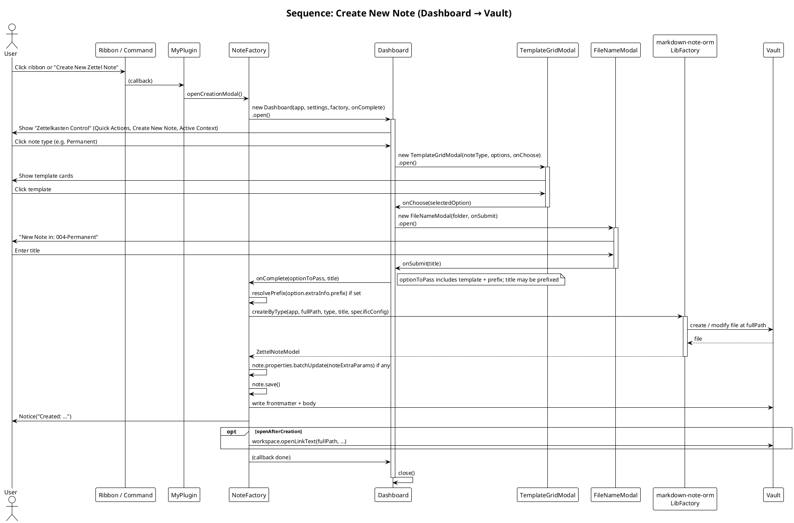
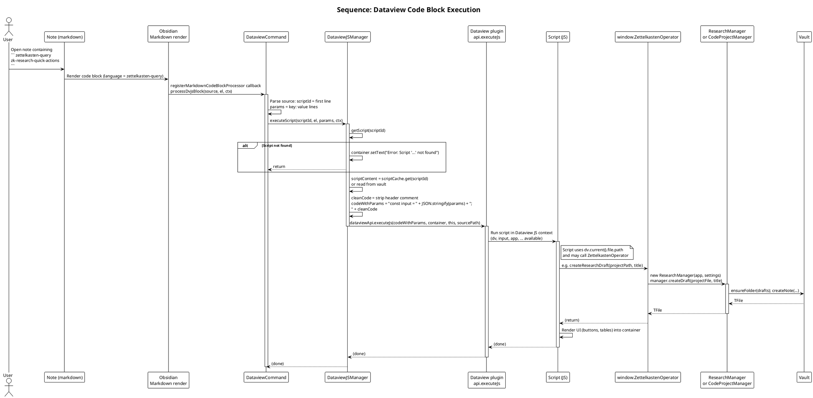
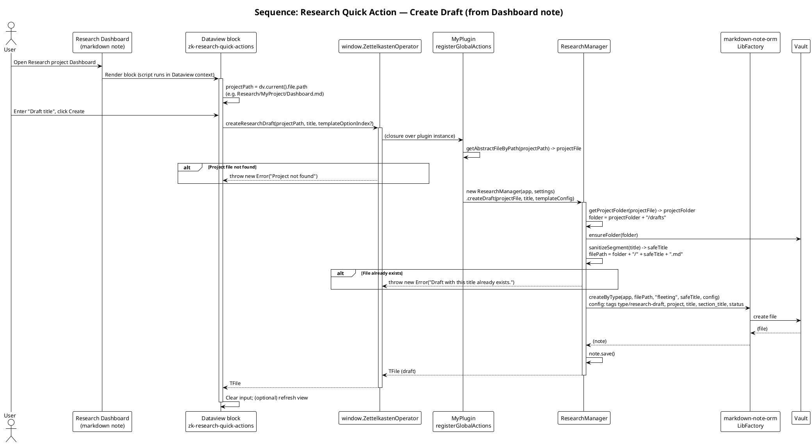
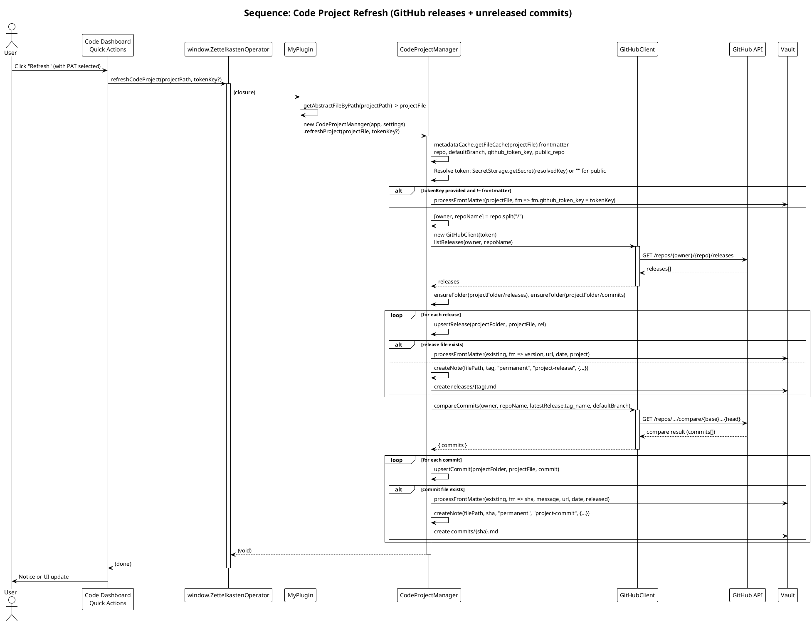
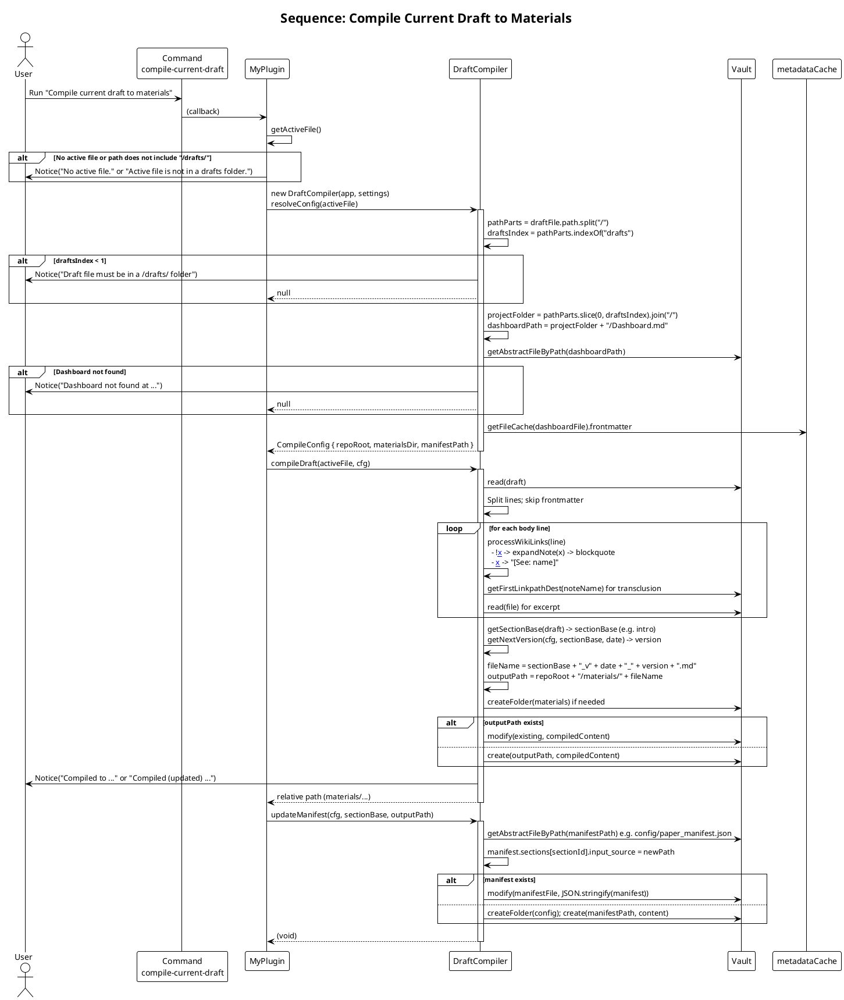

# Architecture Diagrams

This document contains all PlantUML diagrams for the Zettelkasten Operator plugin. These diagrams illustrate the class structure, component relationships, and key execution flows.

**How to view these diagrams:**

1. **Online**: Copy the PlantUML code and paste it into [plantuml.com/plantuml](https://plantuml.com/plantuml)
2. **VS Code**: Install the "PlantUML" extension, then open the `.puml` files in `docs/diagrams/`
3. **CLI**: Install PlantUML and run `plantuml docs/diagrams/*.puml` to generate images

---

## 1. Class Diagram

**Purpose**: Shows all major classes, their relationships, and the four architectural layers (Plugin Core, Service Layer, Dataview Layer, UI Layer).

**Key insights**:
- `MyPlugin` holds `NoteFactory` and optional `DataviewCommand`
- Managers (`ResearchManager`, `CodeProjectManager`) are created on-demand, not held as singletons
- `DataviewCommand` wraps `DataviewJSManager` which manages script loading and execution
- All modals are opened from `Dashboard` or directly from `NoteFactory`

```plantuml
@startuml class
!theme plain
skinparam classAttributeIconSize 0
skinparam classFontStyle bold

title Zettelkasten Operator — Class Overview

package "Plugin Core" {
  class MyPlugin {
    + settings: ZettelkastenSettings
    + factory: NoteFactory
    + dataview?: DataviewCommand
    --
    + onload(): Promise<void>
    + loadSettings(): Promise<void>
    + saveSettings(): Promise<void>
    - registerGlobalActions(): void
    + onunload(): void
  }

  class SampleSettingTab {
    - plugin: MyPlugin
    - activeTab: general | projects | dataview | templates
    - editingIndex: number | null
    --
    + display(): void
    - renderGeneralSettings(container)
    - renderProjectsSettings(container)
    - renderDataviewSettings(container)
    - renderSummaryView(container)
    - renderDetailView(container, index)
  }

  class ZettelkastenSettings <<interface>> {
    dateFormat
    fleetingPath
    literaturePath
    atomPath
    permanentPath
    researchRootPath
    projectRootPath
    dataviewEnabled
    dataviewQueryPath
    dataviewCodeBlockType
    searchDefaultPath
    ganttStatusColors
    createNoteOptions
  }
}

package "Service Layer" {
  class NoteFactory {
    - app: App
    - settings: ZettelkastenSettings
    --
    + initialize(settings): Promise<void>
    + openCreationModal(): void
    + createZettel(type, title, folder, config?, extra?): Promise<ZettelNoteModel>
    + loadNote(path): Promise<ZettelNoteModel>
    + loadActiveNote(): Promise<ZettelNoteModel>
  }

  class ResearchManager {
    - app: App
    - settings: ZettelkastenSettings
    --
    + createProject(name): Promise<TFile>
    + createObjective(projectFile, title): Promise<TFile>
    + createStep(projectFile, objectiveFile, title): Promise<TFile>
    + createExperiment(projectFile, title): Promise<TFile>
    + createRequirement(projectFile, title): Promise<TFile>
    + createDraft(projectFile, title, templateConfig?): Promise<TFile>
    + listProjects(): Promise<TFile[]>
    + updateDashboardProperties(filePath, updates): Promise<void>
    + pushToGitHub(projectFile, tokenKey?): Promise<void>
    - createNote(...): Promise<TFile>
    - ensureFolder(path): Promise<void>
  }

  class CodeProjectManager {
    - app: App
    - settings: ZettelkastenSettings
    --
    + createProject(name): Promise<TFile>
    + createRequirement(projectFile, title): Promise<TFile>
    + refreshProject(projectFile, tokenKey?): Promise<void>
    + updateDashboardProperties(filePath, updates): Promise<void>
    + listProjects(): Promise<TFile[]>
    - createNote(...): Promise<TFile>
    - upsertRelease(folder, projectFile, release): Promise<void>
    - upsertCommit(folder, projectFile, commit): Promise<void>
  }

  class DraftCompiler {
    - app: App
    - settings: ZettelkastenSettings
    --
    + resolveConfig(draftFile): Promise<CompileConfig | null>
    + compileDraft(draft, cfg): Promise<string>
    + updateManifest(cfg, sectionId, newPath): Promise<void>
    - processWikiLinks(line): Promise<string>
    - expandNote(noteName, fullContent): Promise<string>
  }

  class PromptGenerator {
    - app: App
    - settings: ZettelkastenSettings
    --
    + generatePrompt(draft): Promise<string>
    - extractLinks(content): string[]
    - classifyLinks(links): Promise<ClassifiedLinks>
    - cleanNarrative(content): string
    - buildPrompt(...): string
  }

  class GitHubClient {
    - token: string
    --
    + listReleases(owner, repo): Promise<any[]>
    + compareCommits(owner, repo, base, head): Promise<any>
    - getJson<T>(url): Promise<T>
  }
}

package "Dataview Layer" {
  class DataviewCommand {
    - app: App
    - plugin: MyPlugin
    - dataviewManager: DataviewJSManager
    - processorRegistered: boolean
    --
    + initialize(): Promise<void>
    + refresh(): Promise<void>
    + unload(): void
    - registerCodeBlockProcessor(): void
    - processDvjsBlock(source, el, ctx): Promise<void>
  }

  class DataviewJSManager {
    - scripts: Map<string, IDataviewScript>
    - scriptCache: Map<string, string>
    - scriptsFolder: string
    - fileWatcherRef: EventRef[]
    --
    + onload(): Promise<void>
    + getScript(id): IDataviewScript | undefined
    + executeScript(scriptId, container, params, ctx?): Promise<void>
    + cleanUpFileWatchers(): void
    - createDefaultScripts(): Promise<void>
    - loadAllScripts(): Promise<void>
    - loadScript(file): Promise<void>
    - registerFileWatchers(): void
    - createScript(id, name, content, options?): Promise<IDataviewScript>
  }

  class DataviewScriptBuilder {
    - manager: DataviewJSManager
    - script: Partial<IDataviewScript>
    --
    + id(id): this
    + name(name): this
    + description(desc): this
    + content(scriptContent): this
    + build(): Promise<IDataviewScript>
  }
}

package "UI Layer (Modals)" {
  class Dashboard {
    - settings: ZettelkastenSettings
    - factory: NoteFactory
    - onComplete: OnNoteCreateCallback
    --
    + onOpen(): void
    - renderQuickAccess(container)
    - renderNewNoteSection(container)
    - renderActiveNoteSection(container)
    - renderUpgradeSection(container)
    - renderCategoryGrid(container, types)
  }

  class SearchModal {
    - settings: ZettelkastenSettings
    - factory: NoteFactory
    - targetDirectory: string
    - searchResults: ISearchResult[]
    --
    + onOpen(): void
    - refreshAllResults(): void
    - performSearch(): void
    - handleCreateOpen(name): void
  }

  class TemplateGridModal {
    - noteType: NoteType
    - options: INoteOption[]
    - onChoose: (item: INoteOption) => void
    --
    + onOpen(): void
  }

  class FileNameModal {
    - referencePath: string
    - onSubmit: (title: string) => Promise<void> | void
    --
    + onOpen(): void
  }

  class ResearchProjectsModal {
    - settings: ZettelkastenSettings
    --
    + onOpen(): void
  }

  class CodeProjectsModal {
    - settings: ZettelkastenSettings
    --
    + onOpen(): void
  }
}

' Relationships
MyPlugin --> NoteFactory : holds
MyPlugin --> DataviewCommand : holds (optional)
MyPlugin --> SampleSettingTab : adds tab
MyPlugin ..> ZettelkastenSettings : uses
MyPlugin ..> ResearchManager : creates on demand
MyPlugin ..> CodeProjectManager : creates on demand
MyPlugin ..> DraftCompiler : creates on demand
MyPlugin ..> PromptGenerator : creates on demand

SampleSettingTab --> MyPlugin : plugin
SampleSettingTab ..> ZettelkastenSettings : edits

NoteFactory --> Dashboard : opens
NoteFactory ..> ZettelkastenSettings : uses
Dashboard --> TemplateGridModal : opens
Dashboard --> FileNameModal : opens
Dashboard --> SearchModal : opens
Dashboard --> ResearchProjectsModal : opens
Dashboard --> CodeProjectsModal : opens
Dashboard --> NoteFactory : uses

DataviewCommand --> DataviewJSManager : holds
DataviewJSManager --> DataviewScriptBuilder : createScriptBuilder()
DataviewJSManager ..> MyPlugin : plugin.settings

CodeProjectManager --> GitHubClient : uses

@enduml
```



---

## 2. Sequence: Create New Note

**Purpose**: Shows the complete flow from user clicking the ribbon icon to a note being created in the vault.

**Key steps**:
1. User triggers ribbon/command → `NoteFactory.openCreationModal()`
2. Dashboard opens → user selects note type → TemplateGridModal → FileNameModal
3. `NoteFactory.createZettel()` calls `markdown-note-orm`'s `LibFactory.createByType()`
4. Note is saved to vault with frontmatter and body

**When to reference**: Debugging note creation issues, understanding template/prefix resolution, or tracing where frontmatter comes from.



---

## 3. Sequence: Dataview Code Block Execution

**Purpose**: Illustrates how a ` ```zettelkasten-query ` code block in a note triggers script execution and how scripts call back into the plugin via `window.ZettelkastenOperator`.

**Key steps**:
1. Obsidian renders markdown → code block processor (`DataviewCommand`) intercepts
2. `DataviewCommand` parses script ID and params → delegates to `DataviewJSManager`
3. Manager loads script from cache/vault → passes to Dataview's `executeJs()`
4. Script runs in Dataview context → calls `ZettelkastenOperator` methods → creates managers → vault operations

**When to reference**: Debugging "Script not found", understanding how scripts access `dv.current().file.path`, or tracing why a Quick Action button doesn't work.



---

## 4. Sequence: Research Quick Action — Create Draft

**Purpose**: Shows how a user action in a Research Dashboard note (clicking "Create" in the Quick Actions block) creates a draft file.

**Key steps**:
1. User opens Research Dashboard → Dataview block renders → Quick Actions UI appears
2. User enters draft title → clicks Create → script calls `ZettelkastenOperator.createResearchDraft()`
3. Plugin resolves project file → creates `ResearchManager` → `createDraft()` → `createNote()` → vault

**When to reference**: Debugging "Project not found" errors, understanding how `dv.current().file.path` is used, or tracing draft creation failures.



---

## 5. Sequence: Code Project Refresh

**Purpose**: Shows how refreshing a code project fetches GitHub releases and commits, then creates/updates vault files.

**Key steps**:
1. User clicks Refresh in Quick Actions → `refreshCodeProject()` → `CodeProjectManager.refreshProject()`
2. Manager reads dashboard frontmatter (repo, token key) → resolves token from SecretStorage
3. `GitHubClient.listReleases()` → GitHub API → releases array
4. For each release: `upsertRelease()` → create/update `releases/{tag}.md`
5. `GitHubClient.compareCommits()` → unreleased commits → `upsertCommit()` → create/update `commits/{sha}.md`

**When to reference**: Debugging GitHub API failures, understanding token resolution, or tracing why releases/commits aren't syncing.



---

## 6. Sequence: Compile Current Draft to Materials

**Purpose**: Shows how the "Compile current draft to materials" command processes a draft file, expands wiki links, and creates a versioned materials file.

**Key steps**:
1. User runs command with a draft file active → `DraftCompiler.resolveConfig()` → finds project dashboard → reads config
2. `compileDraft()` → reads draft → processes each line:
   - `![[NoteName]]` → expands to blockquote with note content
   - `[[NoteName]]` → replaces with `[See: name]`
3. Generates versioned filename (`section_v20240204_01.md`) → writes to `materials/`
4. `updateManifest()` → updates `config/paper_manifest.json` with new materials path

**When to reference**: Debugging wiki link expansion failures, understanding version numbering, or tracing manifest updates.



---

## Summary

These diagrams cover:

- **Class Diagram**: Static structure and relationships
- **Create Note**: User-initiated note creation flow
- **Dataview Execution**: How code blocks trigger scripts and call back to the plugin
- **Research Create Draft**: Quick Action flow from dashboard to vault
- **Code Refresh**: GitHub API integration and file sync
- **Compile Draft**: Wiki link expansion and materials generation

For more details on components, debugging, and call flows, see [architecture.md](architecture.md).
